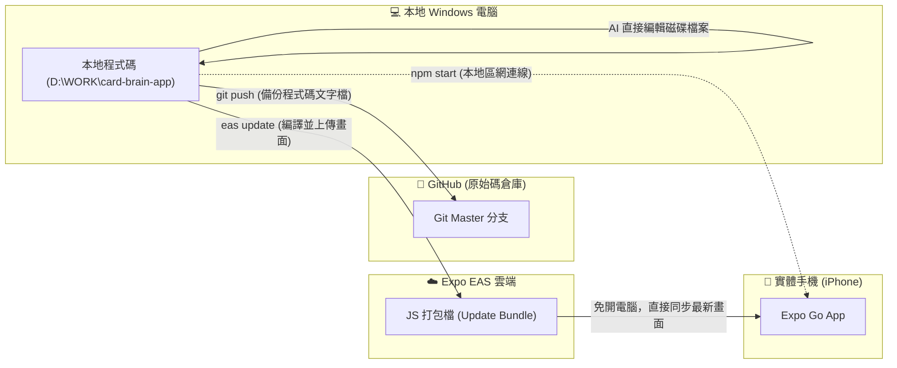

# 📱 Expo SDK 升級與 EAS 雲端更新避坑手冊

本手冊記錄 Card Brain 專案在升級 Expo SDK (特別是從 SDK 54 升級至 SDK 57) 與進行 EAS OTA 雲端更新時遇到的關鍵陷阱、心智模型與標準作業流程 (SOP)。

---

## 🧠 1. 核心心智模型：程式碼在哪裡？

很多時候指令看似簡單卻卡關，是因為對「這台電腦、Git、Expo 雲端、手機 App」四者之間的資料流向有認知落差：



### 💡 重點觀念
1. **AI 修改就是本機修改**：AI 是直接在您本地的 Windows 磁碟修改程式碼。修改完畢後**本機電腦不需要也不用再執行 `git pull`**，因為它就已經是最新檔案！
2. **`git push` ≠ `eas update`**：
   - `git push`：只把「文字檔程式碼」存到 GitHub，手機上的 Expo Go **完全看不到任何變更**。
   - `eas update`：把前端打包成手機讀得懂的 Bundle 上傳到 Expo 雲端，**手機 Expo Go 才能在不開電腦的情況下直接同步最新版**。
3. **使用者預設情境**：使用者習慣隨身攜帶手機使用 Expo Go 記帳（不開電腦），因此**每次前端功能或設定修改告一段落，終點必須是 `eas update`**。

---

## ⚠️ 2. 升級與 EAS 兩大「致命踩坑點」

### 坑點 1：Bare Workflow 下的 `runtimeVersion` 報 500 錯誤
- **觸發原因**：
  專案曾在 Mac 上執行過 Xcode 原生打包，因此目錄下存在 `ios/` 資料夾。在 Expo 體系中，這會被判定為 **Bare Workflow (裸專案)**。
- **錯誤現象**：
  手機掃描 QR Code 或連線雲端時，彈出 `HTTP response error 500: CommandError: You're currently using the bare workflow, where runtime version policies are not supported.`
- **必改設定 (`mobile/app.json`)**：
  ❌ **錯誤寫法 (Managed 預設)**：
  ```json
  "runtimeVersion": {
    "policy": "appVersion"
  }
  ```
  ✅ **正確寫法 (Bare 專案必須寫死字串)**：
  ```json
  "runtimeVersion": "1.0.0"
  ```

---

### 坑點 2：Expo SDK 跨版本升級的套件遺漏
- **觸發原因**：
  升級 Expo 主版本時（如 SDK 54 -> 57），部分過往內建的套件會被移出或發生 peer dependency 衝突。
- **常踩雷套件**：
  1. **`@expo/vector-icons`**：在升級時若被 npm 自動修剪 (prune)，會導致所有畫面圖示找不到 module 而無法編譯。
     - **解法**：手動補安裝 `npm install @expo/vector-icons`。
  2. **`@expo/config-plugins`**：若有原生外掛 (`@react-native-community/datetimepicker`)，缺少此套件會導致 `expo config` 崩潰。
     - **解法**：補安裝 `npm install @expo/config-plugins --legacy-peer-deps`。

---

## 📋 3. 升級與發布標準 SOP (Token 節省檢查表)

未來若需再次升級 Expo SDK 或推送全域變更，請嚴格按照以下 SOP 執行，**避免來回猜測消耗 Token**：

### 步驟 A：升級前檢查 (問 AI 或由 AI 自檢)
1. 檢查 `mobile/ios/` 是否存在？若存在，確認 `app.json` 的 `runtimeVersion` 為純字串（如 `"1.0.0"`）。
2. 執行升級指令並使用 `--legacy-peer-deps` 避免依賴樹死鎖：
   ```bash
   npx expo install expo@latest --legacy-peer-deps
   ```
3. 確保 `@expo/vector-icons` 與 `@expo/config-plugins` 健在：
   ```bash
   npx expo config --json --type public
   ```
   *(若這行指令印出正常 JSON 且 Exit Code 0，代表專案設定無虞)*

---

### 步驟 B：發布至 Expo 雲端 (供手機離線測試)
在 `mobile` 目錄執行非互動式 EAS 發布：
```bash
npx eas-cli update --branch master --message "升級至 SDK XX 與權益更新" --environment production --non-interactive
```

---

### 步驟 C：同步至 GitHub
```bash
git add .
git commit -m "Feat: 升級 Expo SDK 並完成 EAS 雲端部署"
git push origin master
```

---

## 🎯 4. 下次下指令的黃金模板

若下次遇到手機 Expo Go 提示版本不相容或需要升級時，建議這樣下指令：

> **「我的手機 Expo Go 提示要升級 SDK。請先幫我檢查 `app.json` 與相關依賴設定，升級後直接幫我推送到 EAS 雲端，讓我手機不用開電腦也能直接拉到最新版。」**

這句話包含了：
1. **明確目標**：升級 SDK。
2. **防呆要求**：先檢查設定檔（避免 bare workflow 衝突）。
3. **終點定義**：推送到 EAS 雲端（非僅本地啟動或僅 Git 備份）。
一次到位，節省 80% 的來回偵錯與 Token 消耗！
