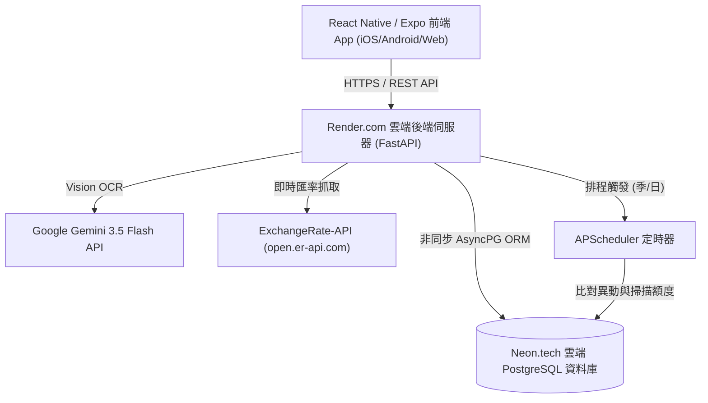

# 💳 信用卡權益追蹤與智能額度管理 App (Card Brain)

## 專案開發成果總結報告

## 🎯 1. 專案簡介與目標

本專案旨在解決台灣信用卡使用者常見的三大痛點：

1. **權益頻繁變動難追蹤**：各家銀行權益每季/半年更動，加碼條件複雜。
2. **加碼回饋上限易爆額**：各通路加碼設有月上限（如 2000元/3000元），超額即降回基礎回饋。
3. **記帳繁瑣與外幣換算**：紙本收據、LINE Pay 截圖、海外消費（如韓國 Olive Young、淘寶、日本實體店）匯率換算費時費力。

本系統透過 **FastAPI 後端 + React Native (Expo) 前端 + Gemini 3.5 Flash 視覺 AI + APScheduler 自動排程 + Neon PostgreSQL 雲端資料庫**，打造雙平台智能信用卡大腦。

---

## 🛠️ 2. 技術棧與系統架構



| 層級                  | 技術選型                                     | 說明                                   |
| :-------------------- | :------------------------------------------- | :------------------------------------- |
| **前端 (Mobile)**     | React Native, Expo SDK 57, TypeScript, AsyncStorage | 跨平台 iOS/Android/Web，支援離線快取與 EAS 熱更新 |
| **後端 (Backend)**    | Python 3.10+, FastAPI, SQLAlchemy 2.0 (Async)| 部署於 Render.com 雲端平台             |
| **資料庫 (Database)** | PostgreSQL (`Neon.tech`, asyncpg)            | 永久免費 Serverless 關聯資料庫 (支援冷啟動休眠) |
| **AI 視覺辨識**       | Google `gemini-3.5-flash` (google-genai SDK) | 收據照片、LINE Pay / 載具截圖 OCR 提取 |
| **自動化排程**        | APScheduler (AsyncIO)                        | 每季初自動爬蟲、每日 09:00 額度掃描警報 |
| **匯率服務**          | ExchangeRate-API 開放端點 + 內建備援機制     | 支援 JPY, KRW, CNY, USD 等外幣即時折算台幣 |

---

## 🚀 3. 已完成的 6 大核心任務細節

### 任務 1：基礎骨架與健康檢查

- 建立前後端目錄結構（後端在 `D:\WORK\card-brain-app\backend`，前端在 `D:\WORK\card-brain-app\mobile`）。
- 完成 CORS 跨域設定與 `/api/v1/health` 健康檢查端點。

### 任務 2：資料庫 Schema 與 Onboarding 選卡流程

- 設計並建立 8 張 ORM 資料表：
  `User`, `Card`, `CardBenefit`, `UserCard`, `Transaction`, `MonthlyUsage`, `AppAlert`, `BenefitSnapshot`。
- **身分驗證與資安**：實作訪客與會員雙軌制，密碼採用原生 `bcrypt` 安全雜湊。
- **額度分離架構**：`MonthlyUsage` 加入 `card_benefit_id`，確保同一張卡的不同加碼通路（如國內一般消費 vs 日系名店）額度能完全獨立精算與消耗。
- 初始化 Seed 資料：寫入永豐大戶卡、永豐幣倍卡、台新 Richart 卡、玉山 Unicard、星展傳說對決卡、聯邦吉鶴卡等銀行卡片與加碼規則。
- 完成選卡與結帳日自訂 API，讓使用者選擇持有卡片並設定個人化帳單結帳日 (1~31 號)。

### 任務 3：消費決策推薦引擎 (Recommendation Engine)

- 實作 `/api/v1/recommend` 端點：輸入「消費金額 + 支付通道或特店名稱 (如 星巴克、Apple Pay)」。
- 自動結合 `billing_cycle.py` 判斷當前帳單週期，計算各卡片剩餘加碼額度。
- 推薦「當下預估回饋金最高」且「額度未滿」的最佳卡片，支援 `exclude_registration` 動態排除需繁瑣登錄之權益。

### 任務 4：多軌相機記帳 (AI 辨識 + 手動) 與權益精算引擎

- **軌道 1 (AI 收據辨識)**：後端呼叫 Gemini 3.5 Flash 精準解析實體收據或相簿內截圖的金額、幣別、日期與商家。
- **軌道 2 (手動記帳)**：提供跨平台優化的手動記帳介面與日期選單 (`DatePickerModal.tsx`)。
- **多幣別自動匯率與回饋精算**：支援 TWD, JPY, KRW, CNY, USD，外幣消費自動換算台幣，精算基礎+加碼回饋金，並寫入 `Transaction` 與動態累加 `MonthlyUsage`。
- **共用額度上限機制 (Shared Cap)**：支援將多個通路綁定至同一個加碼規則下（如星展傳說對決蝦皮/UberEats共用），搭配字串分詞模糊比對，確保額度合併累計。
- **玉山 Unicard 月度權益追溯引擎**：支援「簡單選/任意選/UP選」，當月期中切換方案時，後端自動往前回溯同日曆月所有交易更新模式，並自動重建跨帳單週期的 `MonthlyUsage`，確保留存歷史與額度 100% 精準。

### 任務 5：視覺化動態儀表板與離線快取同步

- **後端彙整 API** (`/api/v1/dashboard`)：回傳全卡本期總消費、總預估回饋、各通道使用率百分比。
- **動態進度條**：使用率 <80% 顯示綠色；>=80% 顯示橘色警示；100% 顯示紅色封頂。
- **離線快取模組** (`src/services/cache.ts`)：支援 AsyncStorage 快取，當雲端 Render 冷啟動或無網路時，展示最後一次同步資料。

### 任務 6：權益異動爬蟲排程與自動化警報

- **爬蟲差異比對引擎** (`services/crawler.py` & `diff_engine.py`)：抓取最新權益並與現有快照比對，產生 `BENEFIT_CHANGE` 異動通知。
- **額度警告掃描**：對額度達 80% 產生 `QUOTA_WARNING`，對 100% 產生 `QUOTA_CAPPED` 警報。
- **APScheduler 自動化排程**：每季 1, 4, 7, 10 月 1 號 00:05 自動跑爬蟲，每日 09:00 自動掃描額度。
- **前端通知與教學支援**：提供獨立的警報 API 端點與原生「使用教學 (`tutorial.tsx`)」導覽分頁。

---

## 📊 4. API 端點清單

| 分類           | HTTP 方法      | API 路徑                     | 功能說明                           |
| :------------- | :------------- | :--------------------------- | :--------------------------------- |
| **系統**       | `GET`          | `/api/v1/health`             | 系統健康檢查                       |
| **會員資安**   | `POST`         | `/api/v1/users/auth`         | 訪客建立與使用者密碼驗證登入/註冊  |
| **卡片權益**   | `GET`          | `/api/v1/cards`              | 查詢所有支援的信用卡與權益         |
| **使用者選卡** | `GET` / `POST` | `/api/v1/user-cards`         | 查詢/新增使用者持有的卡片與結帳日  |
| **推薦引擎**   | `POST`         | `/api/v1/recommend`          | 消費決策推薦最佳卡片               |
| **AI 辨識**    | `POST`         | `/api/v1/ocr/receipt`        | 上傳收據/截圖照片由 Gemini 解析    |
| **交易記帳**   | `POST` / `GET` | `/api/v1/transactions`       | 新增消費記帳 / 查詢明細 (支援 start_date, end_date, user_card_id 日期過濾) |
| **交易重置**   | `DELETE`       | `/api/v1/transactions/reset` | 一鍵清空測試記帳與累計額度         |
| **儀表板**     | `GET`          | `/api/v1/dashboard`          | 取得儀表板彙整資料 (含通道進度條)  |
| **警報通知**   | `GET` / `POST` | `/api/v1/alerts`             | 查詢警報清單 / 標記已讀            |
| **爬蟲觸發**   | `POST`         | `/api/v1/crawl`              | 手動觸發權益爬蟲與額度掃描         |

---

## ✅ 5. 測試驗證紀錄總結

1. **後端 E2E 與單元測試**：執行自動化測試腳本全部通過。
   - NT$1,500 Apple Pay 消費：精算回饋 **NT$37.5** (0.5%基礎 + 2%加碼)。
   - 5,000 JPY 消費：成功依即時匯率換算為台幣並精算回饋。
   - 韓元 (KRW) 與人民幣 (CNY) 消費：成功支援跨國幣別換算與記帳。
   - 額度臨界值測試：使用率達 80% 觸發警告，100% 觸發封頂標記。
   - 日期範圍過濾單元測試 (`test_list_transactions.py`)：驗證時間字串解析與月份範圍篩選 100% 通過。
2. **前端 UI 呈現**：
   - 全域粉色質感主題 (Pink Theme, `#FFF0F5`, `#DB2777`)。
   - `_layout.tsx` 加入 `maxWidth: 480` 置中響應式限制，搭配 Chrome DevTools 可完全模擬智慧型手機操作體驗。

---

## 📌 6. 檔案目錄結構導覽

```
D:\WORK\card-brain-app\
├── backend/                  # FastAPI 後端專案
│   ├── app/
│   │   ├── api/v1/           # API 端點 (users, cards, recommend, transactions, dashboard, alerts)
│   │   ├── db/               # 資料庫初始化 (Neon PG / SQLite) 與 Seed 資料
│   │   ├── models/           # SQLAlchemy 8 大 ORM 模型
│   │   ├── schemas/          # Pydantic 驗證 Schema
│   │   └── services/         # 推薦引擎, OCR, 匯率, 追溯重算, APScheduler
│   ├── card_brain_backup.db  # 本機冷備份檔
│   └── migrate_sqlite_to_pg.py # 一鍵遷移/復原雲端資料庫腳本
└── mobile/                   # React Native (Expo) 前端專案
    ├── app/
    │   ├── (tabs)/           # 5 大 Tab 頁面 (index, recommend, scan, cards, tutorial)
    │   └── _layout.tsx       # 根佈局與身分驗證路由防護
    └── src/
        ├── api/              # Axios API 連線模組 (Interceptor 夾帶 UUID)
        └── services/         # AsyncStorage 離線快取模組
```
