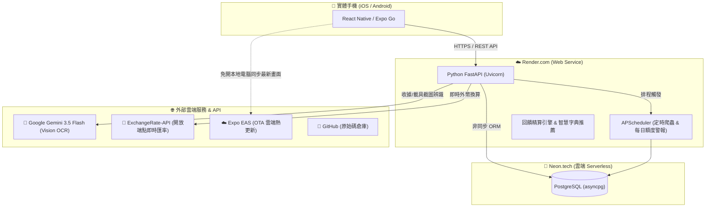
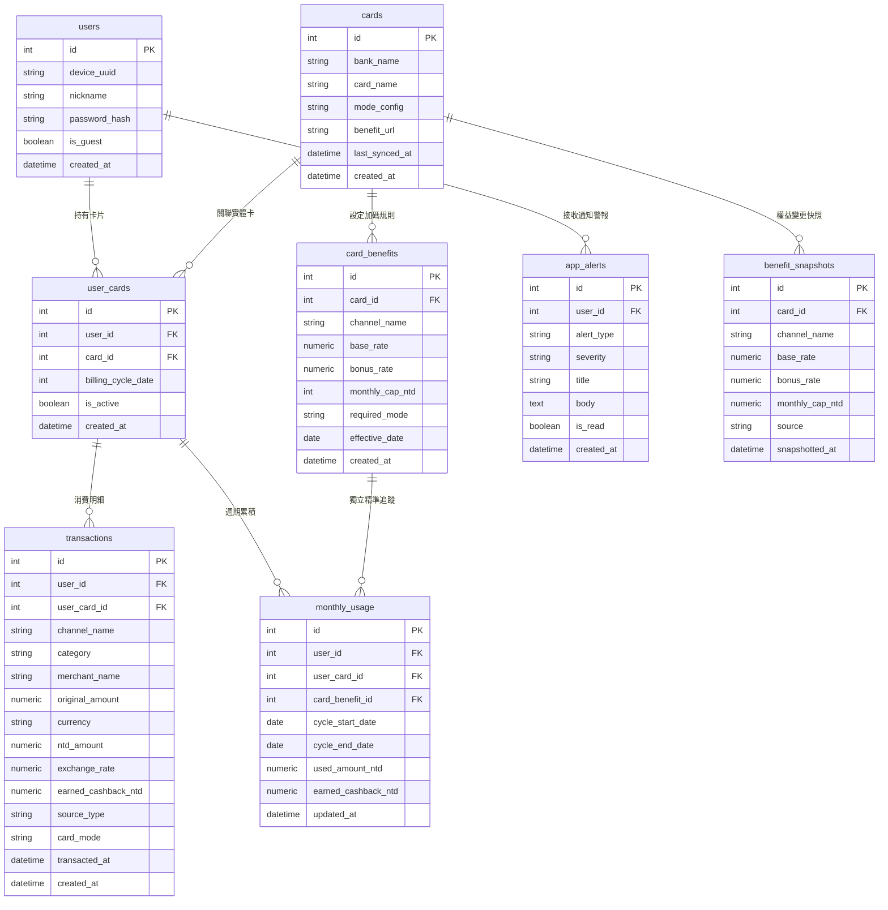
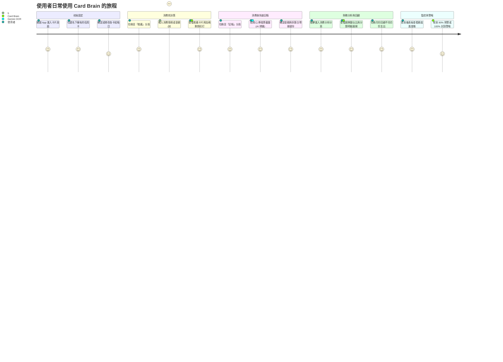

# 🧠 我的信用卡外掛大腦：Card Brain 打造全紀錄（學習歷程・架構・全踩坑血淚寶典）

> **「每次結帳都在想：這筆要刷哪張？回饋幾趴？這期加碼是不是又爆了？」**  
> 為了拯救金魚腦與荷包，我乾脆自己手搓了一個結合「AI 視覺辨識」與「動態回饋精算」的跨平台信用卡外掛大腦 —— **Card Brain**！這篇筆記把之前分散各處的 SDD 系統交接、雲端佈署、架構導覽與踩坑筆記**一次收斂整合成單一終極版本**，並將邏輯斷層、資料庫邊界條件、未被記載的核心商業架構（如玉山 Unicard 整月追溯）與術語全面修正補齊，方便日後自己複習、擴充或展示學習成果！

---

## 🛠️ 一、 專案核心技術棧與雲端架構 (Tech Stack & Cloud)

整個專案的中心思想：極速響應、全自動計算、維運成本極低（全部善用免費雲端 Tier），而且手機能脫離本地電腦開發環境、隨時隨地連網即時記帳！



### 1. 程式語言與前後端框架

#### 前端開發 (Mobile)：

- 語言：`TypeScript` / `JavaScript`
- 核心框架：`React Native` 搭配 `Expo`（由 SDK 54 升級至最新 SDK 57、Expo Router 檔案型路由）。
- UI 與互動：`@expo/vector-icons` (全面使用 Ionicons，徹底淘汰會破版的文字 Emoji)、原生封裝日曆組件 `DatePickerModal.tsx`（解決 iOS 自訂樣式崩潰問題）。
- 狀態與快取：React Hooks (`useState`, `useEffect`)、`Axios` (搭配 Request Interceptor 自動夾帶 `X-Device-UUID`)、`AsyncStorage`（離線快取支援，當 Render 雲端冷啟動或離線時展示快取資料）。
- 幣別支援：支援台幣 (`TWD`)、日幣 (`JPY`)、韓元 (`KRW`)、人民幣 (`CNY`)、美金 (`USD`)，專門滿足出國掃貨（如韓國 Olive Young、日本實體店）與海淘（淘寶、拚多多）記帳需求。
- iOS 實機離線運行架構 (Release vs Debug)：
  - **Debug 模式 (連線版)**：高度依賴電腦端的 Metro Bundler 伺服器，若手機拔掉傳輸線或脫離相同 Wi-Fi 環境，會立刻紅屏報錯 `No script URL provided`。適合日常高頻率開發與測試。
  - **Release 模式 (離線實機版)**：透過 Xcode 原生介面將編譯設定改為 Release，此舉會將前端 JS 邏輯 (JS Bundle) 直接封裝並打包進 iOS `.app` 執行檔中。灌入實體 iPhone 後，完全不需依賴電腦連線，即可隨身帶出門獨立連網記帳！

#### 後端開發 (Backend)：

- 語言：`Python 3.10+`
- 核心框架：`FastAPI`（極速非同步處理，內建 Swagger 互動式 API 文件）。
- 資料層 ORM：`SQLAlchemy 2.0`（Async 非同步架構）搭配 `Pydantic v2` 資料驗證。
- 自動化排程：`APScheduler`（非同步排程，設定每季 1, 4, 7, 10 月 1 日 00:05 啟動爬蟲差異比對；每日 09:00 執行全額度水位掃描產生警報）。
- 資安與身分驗證架構：
- 雙軌身分識別：系統同時支援「訪客模式」與「會員註冊」。無論哪種模式，資料均直接託管於雲端 Neon PostgreSQL。訪客模式透過前端自動生成的裝置唯一碼（`X-Device-UUID`）記帳（`is_guest=True`）；註冊升級為正式會員後，密碼以原生 `bcrypt`（捨棄相容性衝突的 passlib）進行雜湊保存，提供跨裝置無縫繼承與登入防冒用保護。
- 雲端冷啟動（Cold Start）防禦機制：
- Render 免費 Tier 在閒置 15 分鐘後會休眠，重新喚醒需約 45 秒。
- 前端 `client.ts` 明確將 `timeout` 設置為 45,000ms（45 秒），避免使用者掏出手機時過早噴出連線超時錯誤；同時搭配 `AsyncStorage` 在等待期間展現預載資料。

### 2. 資料庫架構演進：從 SQLite 到 Serverless PostgreSQL

- 本機開發與冷備份：`SQLite` (`card_brain.db` / `card_brain_backup.db`)。
- 線上正式環境：`Neon.tech` Serverless PostgreSQL（新加坡節區 `ap-southeast-1`）。
  - 驅動採用 `asyncpg`。
  - 支援無人使用時 CPU 自動休眠，永久免費 0.5GB，極適合自用與低成本雲端運作。
  - 附帶專屬資料遷移腳本 `migrate_sqlite_to_pg.py`，雲端隨時可一鍵無損重新灌入。

### 3. 第三方平台與服務清單

| 服務 / 平台       | 網址 / 部署位置                       | 專案職責                                                                                |
| :---------------- | :------------------------------------ | :-------------------------------------------------------------------------------------- |
| Render.com        | `https://card-brain-app.onrender.com` | 後端 API 雲端容器託管，支援 Git Push 自動 CI/CD 部署。                                  |
| Neon.tech         | `https://neon.tech`                   | 雲端 Serverless PostgreSQL 託管。                                                       |
| Expo EAS          | `https://expo.dev`                    | Mobile 前端 OTA (Over-The-Air) 雲端熱更新與打包。                                       |
| Google Gemini API | Google AI Studio (`gemini-3.5-flash`) | 官方最新 `google-genai` SDK，負責收據發票、載具截圖之結構化 OCR 萃取。                  |
| ExchangeRate-API  | `open.er-api.com` 免費端點            | 即時抓取日幣 (JPY)、韓元 (KRW)、人民幣 (CNY)、美金 (USD) 等匯率折算台幣，免金鑰超穩定。 |
| GitHub            | GitHub Repository                     | 程式碼版本控管與備份。                                                                  |

---

## 🗄️ 二、 資料庫模型設計：關鍵的「額度分離」與共用上限

系統由 **6 大核心業務資料表** 搭配 **2 大系統運維與快照表** 組成，徹底解決了信用卡加碼額度計算最棘手的「互相排擠」、「共用上限」與「方案月度回溯」難題：



### 💡 核心模型重構與資料完整性機制：

1. `monthly_usage` 綁定 `card_benefit_id`（額度分離機制）：
   - 過去設計：整張卡共用一筆 `monthly_usage`。結果一般消費直接把日系名店、外送的加碼額度扣光，導致加碼提前判定封頂！
   - 重構方案：加入 `card_benefit_id` 外鍵。每張卡底下的「國內一般消費」、「LINE Pay 加碼」、「日系特店加碼」各自建立獨立進度條，互不干擾。
2. 防重判斷與動態 UPSERT 機制：
   - 為了避免重複記帳造成額度虛增，在 `transaction_service.py` 應用層中，系統以 `(user_card_id, card_benefit_id, cycle_start_date, cycle_end_date)` 作為唯一鍵值查詢。存在則更新累計金額，不存在則動態開立新週期紀錄（未來擴展規劃將直接於 DB Schema 實體設置 `UniqueConstraint` 強化高併發安全性）。
3. 共用額度上限機制 (Shared Cap) 與模糊關鍵字匹配：
   - 像星展傳說對決卡（蝦皮 / App Store / UberEats 共用 300 元回饋），在 `seed.py` 中將這些特店合併定義在同一條 `card_benefits` 規則中，天然對應到同一個 `monthly_usage` 進行額度合併累計。
   - 為解決通路名稱過長導致推薦不準確的問題，後端搭配 `utils/string_matching.py` 打造分詞與包含度比對機制，使用者輸入「UberEats」即可精確命中該條合併規則。
4. 回饋金額反推消費上限（含防呆判斷）：
   - 許多記帳軟體會誤將「回饋金上限 300 元」當作「消費上限 300 元」。系統以動態計算反推「真實消費上限」：
     - 若 `monthly_cap_ntd IS NULL`：代表該通路加碼無上限，進度條直接標註為「無上限 / 不封頂」。
     - 若 `bonus_rate > 0`：消費上限 = `monthly_cap_ntd ÷ (bonus_rate / 100)`（例如 $300 ÷ 3\% = 10,000$ 元），精確顯示當期進度百分比。
     - 若 `bonus_rate == 0`：防呆回傳無上限，避免除以零崩潰 (`ZeroDivisionError`)。
5. 個人化結帳日與週期判定邏輯：
   - `user_cards` 具備 `billing_cycle_date` 欄位（1~31 號），由 `billing_cycle.py` 根據消費日期 (`transacted_at`) 動態切割。例如結帳日為 18 號，則 8/18 算在本期（7/19~8/18），8/19 則自動滾入下期（8/19~9/18）。
   - 種子資料庫初始化 (`seed.py`) 時，以真實持卡結帳日作為初始預設（永豐 18 號、台新 7 號、玉山 7 號、聯邦 12 號、星展 10 號）。

---

## 🛠️ 三、 玉山 Unicard 方案整月回溯重算機制

玉山 Unicard 的「簡單選／任意選／UP選」採用日曆月結算機制：若使用者於當月月底切換方案，該日曆月內的所有消費將全數依新方案重新計算。

這種設計在記帳系統中容易產生邏輯衝突：

- 方案生效週期：依據日曆月（當月 1 日至最後一日）。
- 額度累積週期：依據信用卡個人的帳單結帳日（例如每月 7 日至次月 6 日）。

兩個週期並非完全對齊，導致方案切換時會橫跨兩個不同的帳單週期。Card Brain 在後端路由（`transactions.py`）透過「時序重播（Replay）」機制處理此問題：

```
使用者於 8/28 記帳時切換模式（例：簡單選 ➔ 任意選）
                           │
                           ▼
  1. 【確認作用範圍】: 檢查 Card.mode_config 是否設定為 scope: "monthly"
                           │
                           ▼
  2. 【更新當月交易】: 檢索 8/1 ~ 8/31 該日曆月的所有交易，將 card_mode 更新為新方案
                           │
                           ▼
  3. 【鎖定受影響週期】: 收集跨週期的範圍集合 affected_cycles: {(7/7, 8/6), (8/7, 9/6)}
                           │
                           ▼
  4. 【清除舊累計】: 刪除受影響帳單週期內的舊 MonthlyUsage 累計資料
                           │
                           ▼
  5. 【時序重播 (Replay)】: 將交易按消費時間重新排序，
     依序調用 calculate_txn_cashback 重算額度水位與每筆回饋金

```

透過清除特定帳單週期的快照並依時序重算，確保使用者即使在月中或月底更換方案，歷史回饋金與剩餘加碼額度依然能與銀行帳單維持一致。

---

## 🎨 四、 UI/UX 設計系統與核心功能模組

專案採用粉色高質感調性 (Pink Theme)，專為 Web 與手機雙端體驗打造：

1. 設計規範：
   - 主視覺強調色 (Primary)：`#DB2777` / `#831843`
   - 背景與線條：`#FFF0F5` / `#FCE7F3`
   - 高亮/成功：`#059669`
   - Icon 規範：全域採用 `@expo/vector-icons` (Ionicons)，嚴禁使用文字 Emoji 作為版面佈局圖示（會導致 Web 排版崩潰與對齊異常）。
2. 五大 Tab 功能模組：
   - 📊 額度儀表板 (`index.tsx`)：視覺化進度條（<80% 綠色、>=80% 橘色警報、100% 紅色封頂）。
   - 🎯 決策推薦 (`recommend.tsx`)：輸入「消費金額 + 商家或通路」，智慧比對「未滿額且回饋最高」卡片；支援 `exclude_registration` 動態過濾「需登錄」權益。
   - 📷 雙軌記帳 (`scan.tsx`)：支援「AI 視覺辨識（Gemini 3.5 Flash）」與「手動補登 + 原生封裝彈出日曆 (`DatePickerModal.tsx`)」；內建多國外幣選擇器 (`CurrencyPickerModal.tsx`)。
   - 📇 卡片管理 (`cards.tsx`)：勾選持有卡片與個別設定結帳日。
   - 📖 使用教學 (`tutorial.tsx`)：原生分頁教學與使用小撇步。

---

## 💣 五、 開發實戰踩坑全記錄 (避坑大全)

這趟開發踩過的坑五花八門，覆蓋了行動端、原生編譯、雲端部署與資安相容性：

### 踩坑 1：從 SQLite 遷移至 Neon PostgreSQL 的線上災難（短暫性磁碟 Ephemeral Storage）

- 原因：本地開發時用 SQLite 超級順，但一部署到 Render 等 PaaS 平台的免費 Web Service，只要伺服器因閒置休眠重啟或每次推送代碼觸發重新部署，寫入本地磁碟的 SQLite 檔案就會被容器抹除、瞬間回到乾淨映像檔狀態（短暫性磁碟機制，Ephemeral Filesystem）。
- 解法：全面切換至 `Neon.tech` 託管的外部 Serverless PostgreSQL。
  - ORM 連線改用 `asyncpg` 協程驅動。
  - 編寫 `backend/migrate_sqlite_to_pg.py`，把原本在 SQLite 的 12 張卡、91 條權益資料一秒無損同步到雲端。
  - 本地 SQLite 保留作為離線冷備份 (`card_brain_backup.db`)，做雙保險。

### 踩坑 2：Expo Bare Workflow 與 EAS 雲端更新的「HTTP 500」大坑

- 原因：為了在 Mac 上打包離線版實體 App，專案執行過原生構建產生了 `ios/` 資料夾，這讓 Expo 判定專案為 Bare Workflow。此時如果 `app.json` 維持預設的 Managed 設定：
  ```json
  "runtimeVersion": { "policy": "appVersion" }
  ```
  在執行 `eas update` 或手機掃碼時，會直接噴錯：  
  `HTTP response error 500: CommandError: You're currently using the bare workflow, where runtime version policies are not supported.`
- 解法：Bare 專案必須明確寫死版本號字串：
  ```json
  "runtimeVersion": "1.0.0"
  ```

### 踩坑 3：心智模型盲點 —— `git push` ≠ `eas update`

- 迷思：改完前端代碼隨手 `git push`，以為手機上的 Expo Go 就會自動更新。
- 真相：
  - `git push origin master`：只是把純文字代碼備份到 GitHub 倉庫。
  - `npx eas-cli update --branch master`：才會將前端 JS 真正編譯打包並發布到 Expo EAS 雲端！
  - 手機端在日常使用時，是靠 Expo Go 直連 EAS 雲端抓取最新的 Bundle。因此**每次前端介面或邏輯修改完畢，發布的最後一步必須是 `eas update`**！

### 踩坑 4：iOS 原生 App 桌面圖示空白 (預設白底無圖)

- 原因：打包給 iPhone 實機後，桌面 Icon 是一片空白。因為 `app.json` 缺少明確的 icon 路徑設定，且 iOS 原生 `.xcassets` 未注入圖示資產。
- 解法：
  1. 於 `mobile/assets/icon.png` 放置粉色系卡片大腦專屬圖示。
  2. 於 `app.json` 加入 `"icon": "./assets/icon.png"`。
  3. 執行 `npx expo prebuild --platform ios` 重新生成原生工程，讓指令將圖示自動注入 Xcode 資產庫中。

### 踩坑 5：免費 Apple 開發者帳號的「7 天續命限制」

- 狀況：透過 Xcode 使用 Personal Team (免費 Apple ID) 安裝到實體 iPhone 的 Release 獨立離線 App，因免費憑證效期限制，7 天一到會強制閃退無法開啟。
- 維護策略：日常記帳建議使用 Expo Go + EAS 雲端更新（無 7 天憑證過期限制）；只有在需要完全無網環境的實測情境下，才插線進 Xcode 重新編譯續命。

### 踩坑 6：iOS 彈出日曆神秘閃退 (PushNotificationIOS Bug)

- 狀況：iOS 點擊日期選擇器 (`DateTimePicker`) 時，App 瞬間崩潰閃退，Log 甚至跳出不相干的推播報錯。
- 原因：iOS 14+ 系統不支援組件傳遞非法 `textColor`，進而引發底層 LogBox 迭代報錯。
- 解法：抽取成專屬組件 `DatePickerModal.tsx`，移除客製化 `textColor` 樣式屬性，改為鎖定 `themeVariant="light"`，無論手機是深色或淺色模式，日曆一律以清晰黑字正常顯示。

### 踩坑 7：Web 版 TextInput 橫向佈局跑版 (Overflow)

- 狀況：在網頁或 Chrome 模擬器中，Flexbox 橫向排列 (`flexDirection: 'row'`) 內的輸入框會無限延伸擠出螢幕外。
- 原因：WebKit / Blink 排版引擎在 Flex 容器中的預設最小尺寸問題。
- 解法：所有橫向輸入容器必須顯式加上 `minWidth: 0`，強迫引擎截斷並維持自適應寬度。

### 踩坑 8：passlib 與 bcrypt 5.x 相容性崩潰

- 狀況：後端處理使用者登入註冊時，呼叫 `passlib.context.CryptContext` 突然噴出 500 內部伺服器錯誤。
- 原因：`passlib` 長期未維護，與最新版 `bcrypt 5.x` 內部 API 發生衝突。
- 解法：徹底拔除 `passlib`，直接改用 Python 原生 `bcrypt` 進行 `bcrypt.hashpw` 與 `bcrypt.checkpw`，輕巧且零相容性問題。

### 踩坑 9：Expo SDK 跨版本升級的套件 Prune 地雷與 EAS non-interactive 陷阱

- 狀況：由 SDK 54 升級至 57 時，Metro Bundler 報錯找不到 `@expo/vector-icons` 或 `@expo/config-plugins`；且執行自動化 `eas update --non-interactive` 時噴錯終止。
- 原因：
  1. npm 在解析跨大版本 peer dependency 衝突時，會自動 prune 掉未顯式宣告在 `dependencies` 的附屬套件。
  2. 新版 EAS CLI 在非互動式環境中，要求必須指定 `--environment`。
- 解法：
  1. 升級後顯式補裝：`npm install @expo/vector-icons @expo/config-plugins --legacy-peer-deps`。
  2. 發布更新時強制指定環境：`npx eas-cli update --branch master --environment production --non-interactive`。

### 踩坑 10：消費分析月份切換未重置（後端漏接日期過濾參數與 JS 浮點數破版）

- 狀況：在「消費分析」頁面切換不同月份時，總支出與分類消費永遠固定不變（每個月都顯示相同的 50 筆消費總和）；且圓餅圖圖例數值偶發出現 `2608.1800000000` 冗長浮點數。
- 原因：
  1. 後端 `GET /transactions` 端點原本僅寫了 `limit=50`，漏宣告 `start_date` 與 `end_date` 查詢參數，導致後端不管前端傳入哪個月，皆固定回傳全歷史最新的前 50 筆消費。
  2. 前端原先使用 `.toISOString()` 產生日期邊界，在 UTC+8 台灣時區產生 8 小時偏差導致跨月邊界位移。
  3. JavaScript 浮點數累加精度遺失（例如 `2608.1800000000003`），直接餵給 `react-native-chart-kit` 導致圖例數值破版。
- 解法：
  1. 後端補齊 `start_date`、`end_date`、`user_card_id` 參數與日期轉換器，在帶有日期篩選時放寬 limit 至 1000 筆。
  2. 前端改採本地時間邊界字串 (`YYYY-MM-01 00:00:00` 至 `YYYY-MM-末日 23:59:59`)，並於客戶端加上雙重保險本地過濾。
  3. 圓餅圖數值統一以 `Number(total.toFixed(2))` 截斷，徹底杜絕小數點溢出。

### 踩坑 11：中文路徑引發的 CocoaPods 與 Hermes 編碼崩潰 (Expo 57 升級災難)

- 狀況：當 Expo SDK 升級（React Native 升級至 0.74+）後，在 Mac 執行 iOS 原生編譯 `pod install` 時，無預警引發 `Invalid hermes-engine.podspec file: incompatible character encodings: BINARY (ASCII-8BIT) and UTF-8` 崩潰。
- 原因：因為專案放置於包含中文字元的資料夾（如 `/芝蓉work/`）中，Ruby 腳本在解析底層 Node 執行路徑時，錯誤地將中文識別為 ASCII-8BIT 編碼，與文件本身的 UTF-8 衝突而導致崩潰。
- 解法：不向中文路徑妥協！我們展現了底層修復能力：
  1. 深入修改 `node_modules` 內的 `hermes-engine.podspec`，對路徑變數強制加上 `.force_encoding('UTF-8')`。
  2. 引入 `patch-package` 並加入 `"postinstall": "patch-package"` 腳本。
  3. 確保未來專案在 Windows 或是另一台新電腦拉取 `npm install` 時，會**全自動打補丁**，徹底跨環境免疫這個深水炸彈。

### 踩坑 12：`prebuild --clean` 導致 Xcode 簽名憑證遺失

- 狀況：升級 Expo SDK 後重新打包實機 App 時，Xcode 突然報錯無法編譯安裝，或終端機提示未設定 Development Team。
- 原因：跨大版本升級時為了避免殘留的 iOS 舊設定衝突，必須執行 `npx expo prebuild --clean`。但這個指令的威力在於它會把整個 `ios` 資料夾「連根拔起」重新生成。這導致原本在 Xcode 中手動勾選的「Automatically manage signing」與「Personal Team (免費開發者憑證)」直接被重置歸零。
- 解法：建立標準化 SOP：只要執行過 `--clean` 清除快取，或是換一台新 Mac 重新 `prebuild`，打包前的第一步**永遠是打開 `CardBrain.xcworkspace` 重新綁定 Apple ID 憑證**。

---

## 📱 六、 快速上手：使用者操作情境與指南 (User Guide)




### 💡 日常情境操作步驟

```
   [ 1. 綁定卡片 ] ──▶ [ 2. 智慧推薦 ] ──▶ [ 3. 多軌記帳 ] ──▶ [ 4. 消費分析 ] ──▶ [ 5. 儀表板監控 ]
  (Cards Tab 勾選)     (消費前查最賺)      (拍照/手動入帳)      (圓餅圖與明細)       (動態彩色進度條)
```

1. **初始化你的卡夾（Cards Tab - `cards.tsx`）**
   - 打開 App 點選底部「卡片」，勾選皮夾裡實際持有的卡（如永豐幣倍、大戶、玉山 Unicard 等）。
   - 點進卡片可檢查每張卡預設的結帳日，若你的結帳日與銀行預設不同，可在這裡直接修改。

   
   
   

2. **消費前一秒查推薦（Recommend Tab - `recommend.tsx`）**
   - 走進店家、掏出錢包前，打開「推薦」分頁。
   - 直接輸入商家或通道（例如：輸入「APP Store」或「LINE Pay」），輸入預計消費金額。
   - 系統會比對所有未滿額的卡片，直接把「回饋趴數最高、能拿最多回饋金」的卡片排在第一名！若不想看需繁瑣登錄的活動，勾選排除需登錄即可。

   

3. **刷完卡極速記帳（Scan Tab - `scan.tsx`）**
   - **AI 視覺辨識**：點擊相機拍實體發票，或直接從相簿挑選 LINE Pay / 載具截圖。Gemini 3.5 Flash 會在 1~2 秒內自動辨識出金額、幣別、日期與店家，完全不用手敲。
   - **手動補登**：若沒有明細，切換手動輸入金額，點選彈出的原生小日曆 (`DatePickerModal.tsx`) 挑選日期即可入帳。
   - **海外消費換算**：若是海外消費（如韓國 Olive Young 刷韓元 KRW、日本刷 JPY、淘寶刷 CNY），選擇對應幣別，系統自動透過即時匯率換算成台幣並精算回饋金。

   
   
   

4. **查看每月消費分析與圓餅圖（Analytics - `analytics.tsx`）**
   - **入口途徑**：在「記帳 (Scan)」分頁下方點擊「📊 本月消費分析」專屬卡片即可進入。
   - **跨月份動態切換與自動重置**：
     - 頂部導覽列提供 `<` `>` 按鈕，亦可點擊下拉選單直接按年份與月份快速跳轉。
     - 系統以「日曆月 (當月 1 號 00:00:00 至末日 23:59:59)」為基準精確過濾。切換到不同月份時，總支出與分類自動重新計算；若該月份無記帳，自動呈現「這個月還沒有記帳紀錄喔！」空狀態。
   - **支出與回饋總額一覽**：
     - 頂部卡片精確彙整當月「本月總支出 (如 $9,502.97)」以及「預估獲得回饋 (如 +$450)」，一眼看清每月花費與實賺回饋金。
   - **視覺化分類圓餅圖**：
     - 支援將支出自動歸類為「購物、餐飲、其他、娛樂、數位網購、交通、固定支出」，以高質感色塊繪製動態圓餅圖。
     - 內建數值精度截斷防護，徹底消除浮點數溢出，數值排版乾淨整齊。
   - **手風琴式分類明細展開**：
     - 下方依消費總額由大到小排序，呈現各分類的金額、佔比與消費筆數。
     - **點擊任一類別**即可觸發平滑動畫向下展開，查看該類別當月每一筆消費明細（包含日期、商家名稱、支付通道與換算台幣金額），財務流向一目了然！

   

5. **監控額度進度條（Dashboard Tab - `index.tsx`）**
   - 隨時回到首頁，查看本期各通路的加碼額度累積：
     * **綠色進度條**：安全水位（使用率 < 80%），放心用力刷。
     * **橘色進度條**：警戒水位（使用率 ≥ 80%），加碼快見底了！
     * **紅色進度條**：已達封頂（使用率 100%），代表加碼回饋拿滿，請換下一張卡刷！

   

